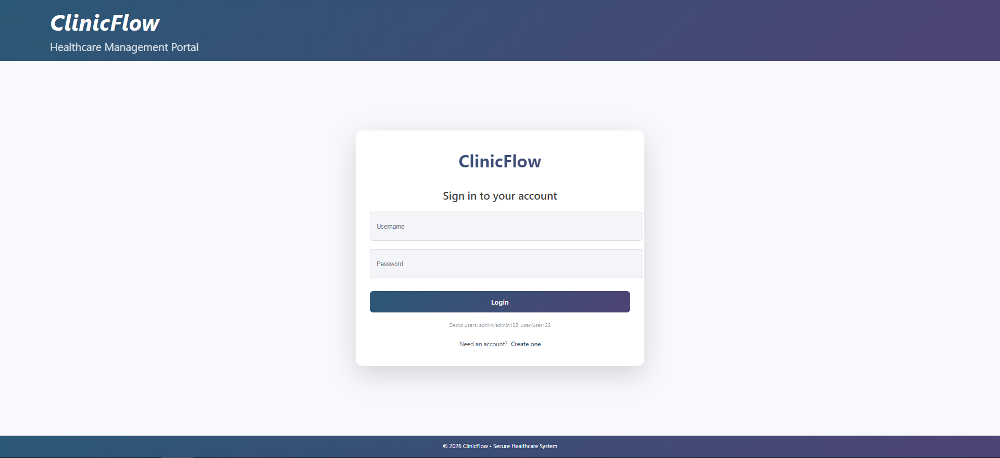
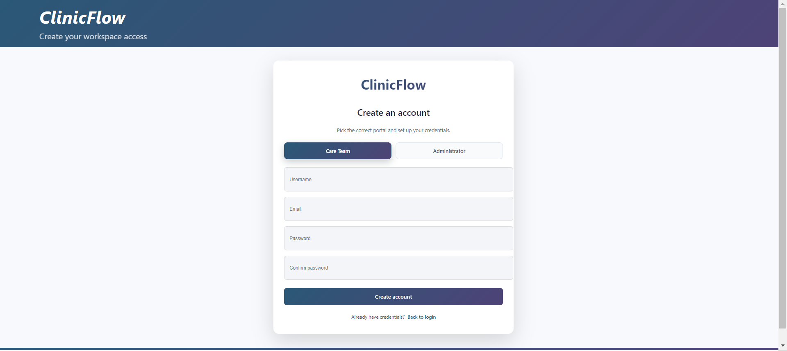
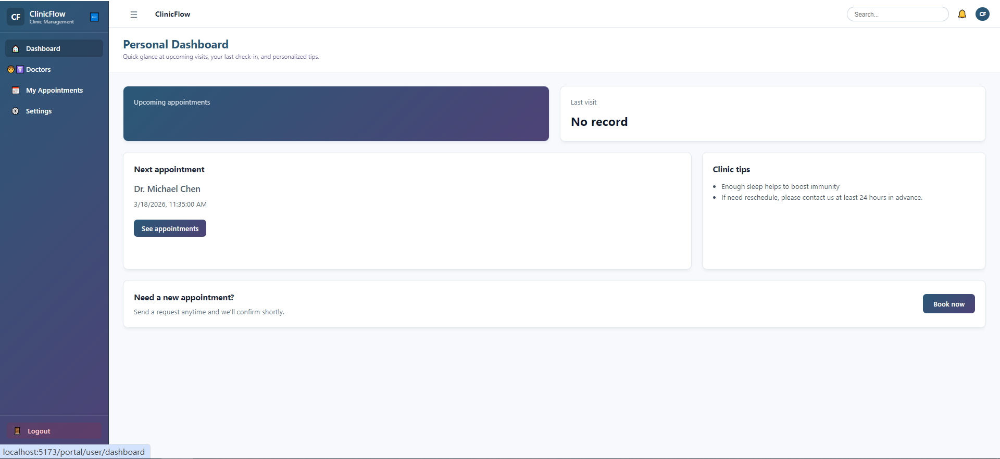
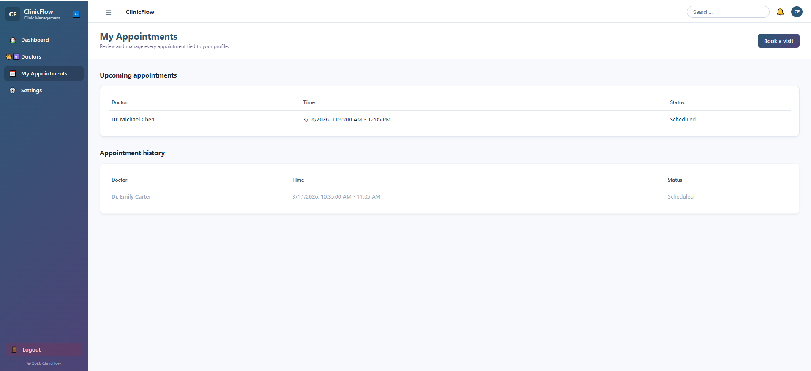
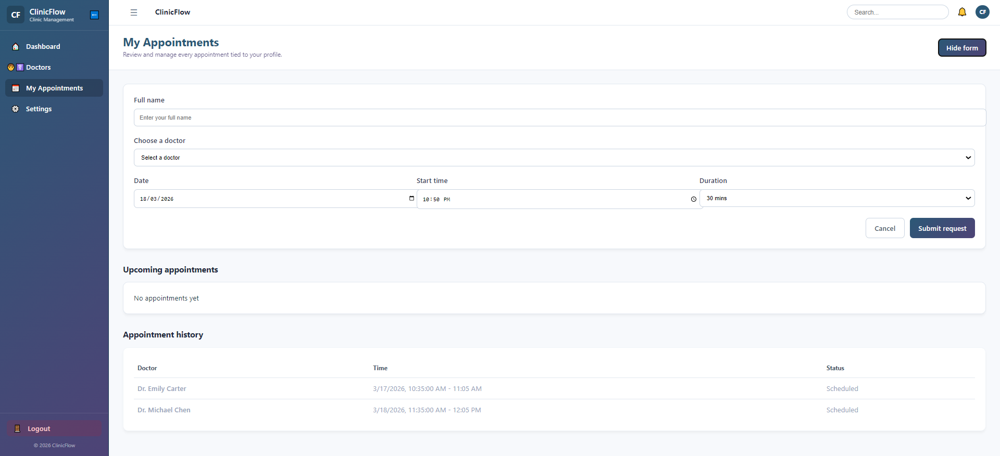

# ClinicFlow- Smart Clinic Management System

A full-stack clinic management - **Smart Appointment Scheduling**: 
<br/>
<p align="center">
  
</p>

## Tech Stack
### Backend
- ASP.NET Core (.NET)
- Entity Framework Core (SQLite)
- C#
- RESTful API
- Swagger / OpenAPI

### Frontend
- React
- TypeScript
- Vite
- React Router DOM
- Axios

## Features
### Role-Based Authorization
- **Admin**: View, Create, Update, Delete appointments
- **User**: View and Update status only
#### Security Flow
- User Login (Demo users provided)
- Receive JWT and Store in context / localStorage
- Attach to every API request via Axios Interceptors
- Backend validates token & authorizes based on role

### Modern UI & Layout
- Global application layout with a collapsible sidebar and unified topbar.
- Responsive, clean, and modern styling (gradients, card shadows, rounded aesthetics) entirely built with inline React styles.
- Integrated routing for separated logical views (Dashboard, Appointments, Patients, Doctors, etc.).

### Login Page
<p align="center">
  
</p>

### Register Page
<p align="center">
  
</p>

- **Select Portal**: Care Team (User) and Administrator (Admin)
- **Admin Portal**: Require Admin Code (CF-ADMIN-2024)

## Admin Portal
### Dashboard
<p align="center">
  
</p>

#### Key Features
- **Total Patients**: Displays the total number of registered patients in the system.
- **Today's Appointments**: Shows the number of appointments scheduled for today.
- **Pending Today**: Indicates how many appointments are still pending.
- **Active Doctors**: Displays the number of doctors currently with active appointments.

#### Data Visualization
- **Weekly Appointment Trend**:
  - Line chart showing trends of total, completed, and cancelled appointments.
  - Helps identify peak days and workload patterns.

#### Operational Insights
- **Doctor Workload (Today)**:
  - Displays each doctor’s appointments (pending, completed, total).
  - Useful for workload balancing.

- **Upcoming Today**:
  - Lists upcoming appointments with patient and doctor info.

- **Recently Added Patients**:
  - Displays newly registered patients for quick access.
### Appointments Management
<p align="center">
  
</p>

- **List View**: Display all appointments in an elegant table.
- **Calendar View**: Interactive, dynamic calendar to visualize monthly appointments. Features date switching (prev/next month), highlighting 'Today', and rendering color-coded appointment badges directly on the calendar grid.


### New Appointment
<p align="center"> 
  
</p>

  - **Patient Selection**: Dropdown to easily select existing patients, dynamically rendering their profile details (DOB, Contact, Gender) instantly.
  - **Doctor Availability**: Dynamically fetches and visualizes unavailable (already booked) time slots based on the selected doctor and date.
  - **Conflict Validation**: Backend strict validation to prevent double-booking for the same doctor.
- **Manage Appointments**: Update status or instantly drop (delete) appointments.

### Patients Management
<p align="center">
  
</p>

- **List View**: Display all registered patients in a clean, modern table matching the app's visual identity. Includes search/filtering by name, phone, email, and gender.
- **Create Patient**: Highly polished data entry form for easily adding new patients into the clinic domain.
- **Edit & Delete**: Full lifecycle management of patient profiles, integrated seamlessly into the list view.

### Doctors Management
<p align="center">
  
</p>

- **List View**: Staff directory with profile photos, availability schedules, contact information and specialties.
- **Create Doctor**: Form optimized for entering staff details, including URL attachment for profile pictures.
- **Edit & Delete**: Robust management capabilities to keep clinic staff data synced and updated.

### Settings & Configuration
<p align="center">
  
</p>

- **Account Profile**: View the signed-in identity, change your password, or switch accounts without refreshing the browser.
- **Clinic Preferences**: Fully wired to the backend — update business hours, slot durations, and notification defaults (admin-only, persisted via the Settings API).

## User Portal
### Dashboard
<p align="center">
  
</p>
The Personal Dashboard provides a quick overview of user activity and upcoming visits.

#### Key Features
- **Upcoming Appointments**: Displays upcoming visits for the user.
- **Last Visit**: Shows the most recent visit record.
- **Clinic Tips**: Provides helpful health and clinic-related tips.

#### Quick Access
- **Next Appointment**:
  - Displays the next scheduled appointment with doctor and time.
  - Includes a shortcut to view all appointments.

- **Book Appointment**:
  - Allows users to quickly navigate to booking a new visit.

### My Appointments
<p align="center">
  
</p>
This page allows users to view and manage all their appointments.

#### Key Features
- **Upcoming Appointments**: Displays all future scheduled visits.
- **Appointment History**: Shows past appointments with details.

#### Appointment Details
- Includes doctor name, appointment time, and status.
- Helps users track and manage their visit history.

### New Appointment (Book Visit)
<p align="center">
  
</p>
This feature allows users to schedule a new appointment with a doctor.

#### Key Features
- **Doctor Selection**: Choose from available doctors.
- **Time Selection**: Select preferred date and time slots.

#### Booking Process
- Submit a booking request through the form.
- The system records and manages the appointment efficiently.

### Doctor
<p align="center">
  
</p>

## TODO 🚀
- **Reporting System**: Export patient and appointment lists to CSV or PDF options for admin users.
- **Usage Analytics**: Surface lightweight charts for patient registrations and appointment throughput.
- **Notifications Hub**: Allow admins to broadcast announcements to all active accounts.

## Project Structure
- clinicflow
- ├─ backend
- │ └─ ClinicFlow.Api
- ├─ frontend
- │ └─ clinicflow-web


## Getting Started

### Backend
```bash
cd backend/ClinicFlow.Api
dotnet run
```

### Frontend
```bash
cd frontend/clinicflow-web
npm install
npm run dev
```

Author

Yino