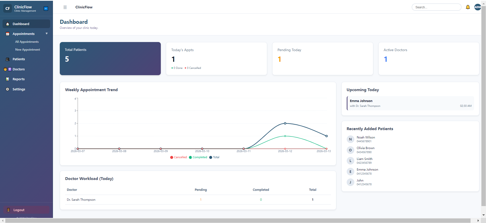
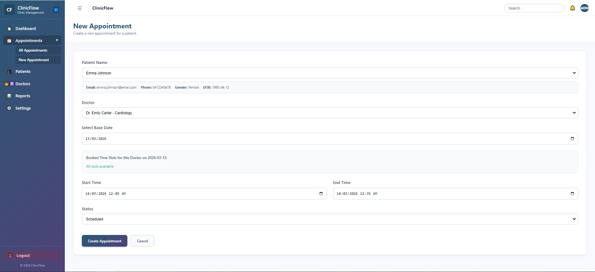
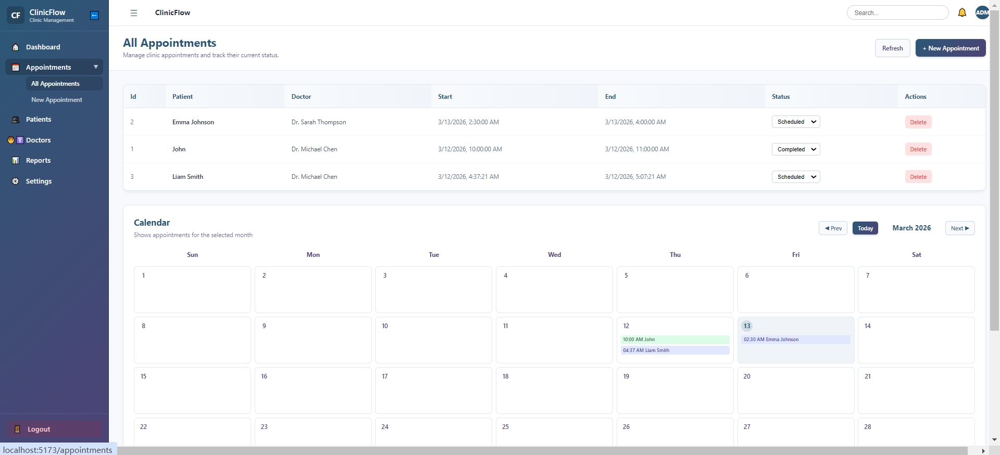
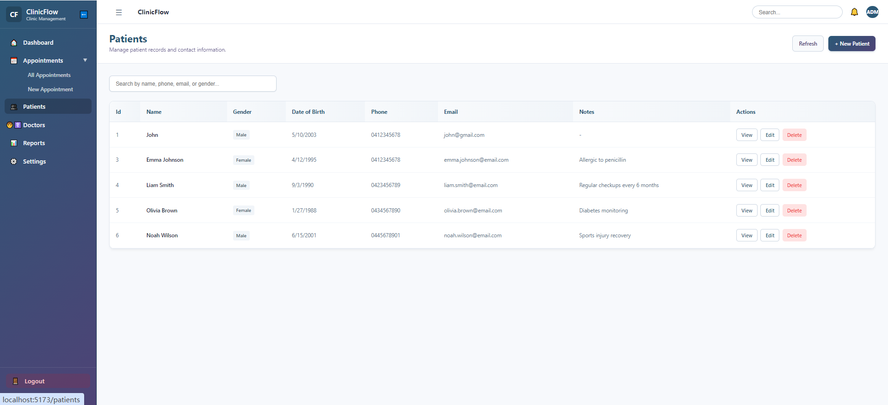
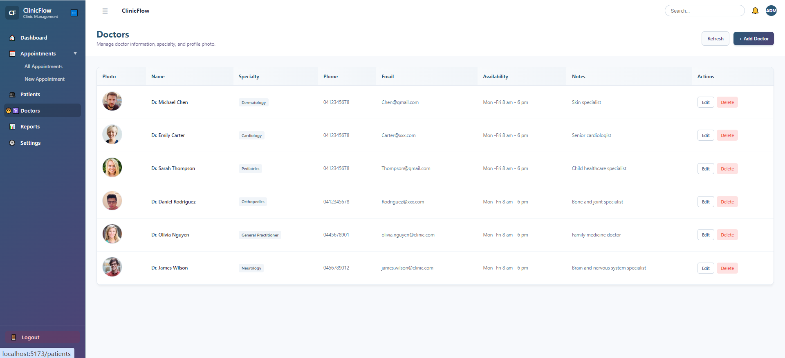
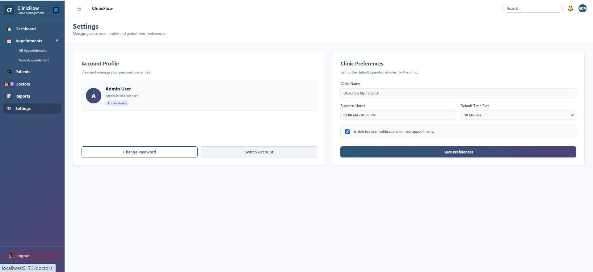

# ClinicFlow 🏥

A full-stack clinic managem- **Smart Appointment Scheduling**: 
<br/>
<p align="center">
  
</p>

## Tech Stack
### Backend
- ASP.NET Core (.NET)
- Entity Framework Core (SQLite)
- C#
- RESTful API
- Swagger / OpenAPI

### Frontend
- React
- TypeScript
- Vite
- React Router DOM
- Axios

## Features
### Role-Based Authorization
- **Admin**: View, Create, Update, Delete appointments
- **User**: View and Update status only
#### Security Flow
- User Login (Demo users provided)
- Receive JWT and Store in context / localStorage
- Attach to every API request via Axios Interceptors
- Backend validates token & authorizes based on role

### Modern UI & Layout
- Global application layout with a collapsible sidebar and unified topbar.
- Responsive, clean, and modern styling (gradients, card shadows, rounded aesthetics) entirely built with inline React styles.
- Integrated routing for separated logical views (Dashboard, Appointments, Patients, Doctors, etc.).

### Appointments Management


- **List View**: Display all appointments in an elegant table.
- **Calendar View**: Interactive, dynamic calendar to visualize monthly appointments. Features date switching (prev/next month), highlighting 'Today', and rendering color-coded appointment badges directly on the calendar grid.


- **Smart Appointment Scheduling**: 


  - **Patient Selection**: Dropdown to easily select existing patients, dynamically rendering their profile details (DOB, Contact, Gender) instantly.
  - **Doctor Availability**: Dynamically fetches and visualizes unavailable (already booked) time slots based on the selected doctor and date.
  - **Conflict Validation**: Backend strict validation to prevent double-booking for the same doctor.
- **Manage Appointments**: Update status or instantly drop (delete) appointments.

### Patients Management


- **List View**: Display all registered patients in a clean, modern table matching the app's visual identity. Includes search/filtering by name, phone, email, and gender.
- **Create Patient**: Highly polished data entry form for easily adding new patients into the clinic domain.
- **Edit & Delete**: Full lifecycle management of patient profiles, integrated seamlessly into the list view.

### Doctors Management


- **List View**: Staff directory with profile photos, availability schedules, contact information and specialties.
- **Create Doctor**: Form optimized for entering staff details, including URL attachment for profile pictures.
- **Edit & Delete**: Robust management capabilities to keep clinic staff data synced and updated.

### Settings & Configuration


- **Account Profile**: Overview of logged-in user credentials and roles.
- **Clinic Preferences**: Manage global business rules like operating hours, default time slots, and UI notification preferences (Frontend Mock).

## TODO 🚀
- **Settings API Integration**: 
  - Connect "Change Password" and "Switch Account" to backend Auth endpoints.
  - Persist Global Clinic Preferences (Business Hours, Time Slots) to the database to sync across all staff users.
- **Reporting System**: Export patient and appointment lists to CSV or PDF options for admin users.

## Project Structure
- clinicflow
- ├─ backend
- │ └─ ClinicFlow.Api
- ├─ frontend
- │ └─ clinicflow-web


## Getting Started

### Backend
```bash
cd backend/ClinicFlow.Api
dotnet run

cd frontend/clinicflow-web
npm install
npm run dev
```

Author

Yino